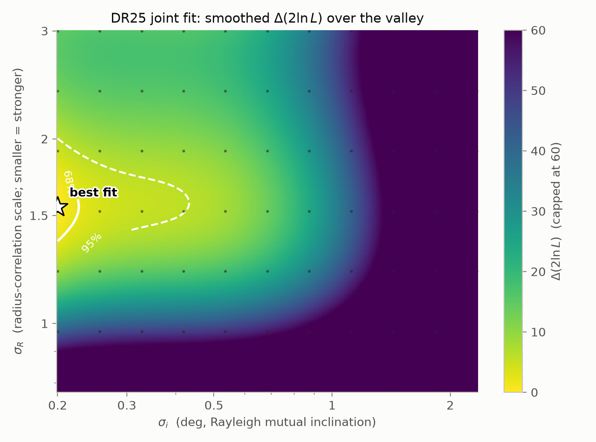
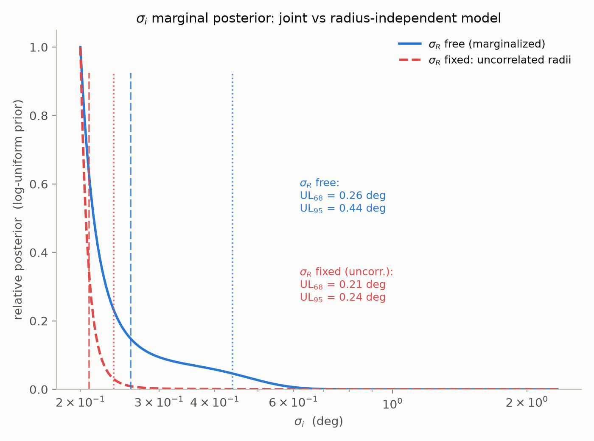
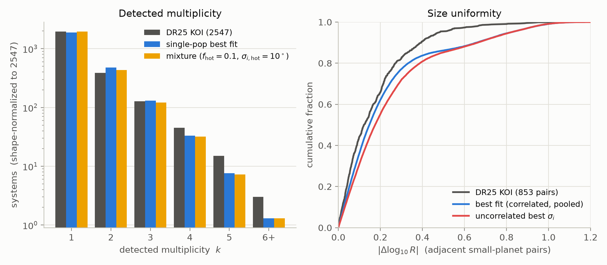
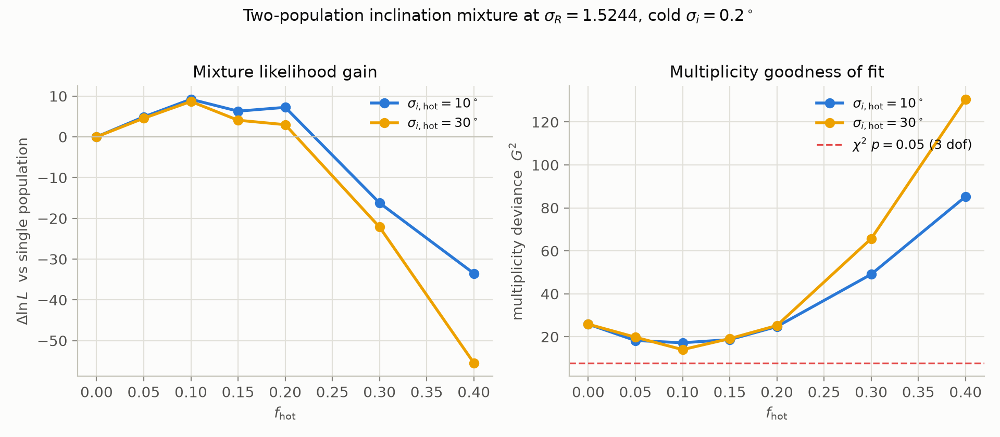

# Decomposing the Kepler dichotomy: mutual-inclination dispersion versus intra-system radius correlation

*Section draft, 2026-07-04. Declared outcome (pre-registered checkpoint
4): joint A+C. Reproduce with `make reproduce-dichotomy`; all numbers
are generated from the cached grids in `results/` and are quoted with
their conditionality.*

## 1. The question

The Kepler sample contains more single-transiting systems, relative to
multis, than a population of coplanar systems drawn from any smooth
multiplicity function would produce — the "Kepler dichotomy" (Lissauer
et al. 2011; Johansen et al. 2012). The standard resolution invokes
mutual-inclination dispersion: tilt planets out of a shared plane and
multi-transiting systems dissolve into singles. But the observed
multiplicity vector is not shaped by geometry alone. Kepler systems are
also radius-uniform ("peas in a pod"; Weiss et al. 2018), and size
correlation changes which systems yield multiple *detections*: if one
planet in a system is large enough to detect, its siblings are more
likely to be as well. Multiplicity and size uniformity are therefore
entangled observables, and the two model knobs that control them —
inclination dispersion σ_i and intra-system radius correlation σ_R —
have generally been fit jointly inside many-parameter forward models
(He, Ford & Ragozzine 2019; He et al. 2020) without an explicit map of
their degeneracy. This section asks the question directly: **how much
mutual-inclination dispersion does the Kepler multiplicity distribution
actually require once intra-system radius correlation is modeled
jointly — and how degenerate are the two effects?**

## 2. Model and inference

We extend the exoverse generator with two orthogonally switchable
parameters (defaults are bit-for-bit identical to the baseline model;
see `docs/sigma_r_note.md` and `docs/phase2_design.md`):

- **σ_R (radius correlation).** A Gaussian copula ties sibling radii to
  a shared system-level latent variable: z = (z_sys + σ_R ε)/√(1+σ_R²),
  with each planet's radius the marginal quantile Φ(z). The population
  radius function is preserved *exactly* at every σ_R; only the
  within-system correlation, ρ = 1/(1+σ_R²), changes. σ_R → 0 is
  perfect radius uniformity; σ_R → ∞ recovers independent draws.
- **σ_i (mutual-inclination dispersion).** Per-planet tilts drawn from
  Rayleigh(σ_i) and applied at a uniform nodal azimuth, with an optional
  second component: a fraction f_hot of systems draws from
  Rayleigh(σ_i,hot) instead.

Synthetic universes are conditioned on the real Kepler DR25 stellar
sample: each of the 137,493 FGK dwarf targets passing our fiducial cuts
(Teff 3900–7300 K, logg ≥ 4.0, dataspan ≥ 1 yr) hosts one generator
draw, and detection is evaluated against that target's own measured
noise and window — RMS CDPP interpolated to the transit duration,
n_tr = dataspan × dutycycle / P ≥ 3, SNR ≥ 7.1. The comparison
catalog is the DR25 KOI table under matching cuts (CONFIRMED +
CANDIDATE, robovetter score > 0.5, P = 0.5–640 d, R_p ≤ 30 R⊕): 2,547
systems with multiplicity vector N_k = (1968, 389, 127, 45, 15, 3) for
k = 1…6+, singles-per-multi ratio 3.40, and 853 adjacent-pair
|Δlog R| values (median 0.122).

Two summary statistics carry the fit, chosen to separate the two
physical effects: the *shape* of the detected multiplicity vector N_k
(occurrence-insensitive multinomial), and the detected-only adjacent-pair
|Δlog R| distribution. Both map onto proper likelihoods — the
multinomial log-likelihood of the observed N_k under pooled synthetic
frequencies, and the log-likelihood of the real |Δlog R| sample under a
reflected kernel density estimate of the pooled synthetic sample (fixed
Silverman bandwidth 0.033) — so credible regions follow from Wilks
thresholds rather than an ad hoc distance weighting. We evaluated a
14 × 16 grid (σ_R log-spaced 0.2–3.0 plus an uncorrelated row; σ_i
log-spaced 0.2°–8°) with 8 seeds per cell, topped up to 16 seeds over
the 85-cell likelihood valley (2,472 simulated universes in total, all
seeded deterministically and cached). Because per-cell Monte-Carlo
noise (~3.0 in ln L) exceeds the 1σ contour spacing, contours and
marginals are read from a cubic polynomial fit to ln L over the valley
in (ln σ_R, ln σ_i); the fit residual (RMS 3.4) is statistically
consistent with pure seed noise, so the smoothing absorbs no real
structure.

## 3. Results

**The two effects are nearly orthogonal, not degenerate (Figure 1).**
Radius
correlation is constrained almost entirely by the size statistic: at
fixed σ_i, ln L varies by ~1,080 across the σ_R axis in the |Δlog R|
term but by ≲6 (within seed noise) in the multiplicity term.
Inclination dispersion is constrained almost entirely by the
multiplicity vector: ~460 in ln L across the σ_i axis in the
multinomial term while the size term stays flat. The posterior
correlation between ln σ_R and ln σ_i is 0.07. The feared degeneracy —
that radius correlation could masquerade as (or hide) inclination
dispersion in the multiplicity vector — is not realized under DR25
conditioning: each observable pins its own parameter. This is the
central methodological result, and it is what makes the following two
statements separable.

**Radius correlation is required, at moderate strength.** The best fit
is σ_R = 1.55 (68% interval [1.50, 1.64]; 95% [1.36, 1.86]),
i.e. sibling radius correlation ρ ≈ 0.29. Both extremes are firmly
excluded: near-perfect radius uniformity (σ_R = 0.2, ρ ≈ 0.96) loses
over 1,000 in ln L, and fully independent radii lose Δln L = 10.3
against the best correlated model. "Peas in a pod" survives joint
modeling as a real but moderate correlation, not the near-clones the
strongest reading of the pattern would suggest — echoing, via a
different construction, the clustered-but-scattered radius model of He
et al. (2019).

**The multiplicity vector requires almost no inclination dispersion in
the dominant population (Outcome A; Figure 2).** The σ_i posterior is
an upper limit: σ_i ≤ 0.26° (68%) and ≤ 0.44° (95%) with σ_R free. Fixing
radii to be uncorrelated *tightens* the limit to ≤ 0.24° (95%) — an
83% narrowing, exceeding the pre-registered 50% threshold for declaring
that the σ_i constraint depends materially on how radii are modeled.
Notably, the mechanism is not parameter covariance (the posterior
correlation is 0.07) but model fit: the correlated-radius model matches
the size data far better and tolerates a slightly wider range of
inclination behavior. Either way, within this generator the cold
population is consistent with *strict coplanarity*; the data supply
only an upper bound.

**A second, dynamically hot population is still demanded (Outcome C;
Figures 3–4).** The best single-Rayleigh model fails on the
multiplicity shape:
G² = 32.6 on 3 degrees of freedom (p ≈ 4×10⁻⁷), overproducing doubles
(480 expected vs 389 observed, shape-matched) and underproducing
singles and high-k systems, with singles-per-multi 2.90 vs the observed
3.40. Adding a hot component at the best-fit σ_R improves the fit by
Δln L = +9.2 for two extra parameters (ΔAIC = −14.4; seed noise ~4.4),
with best values f_hot = 0.10 and σ_i,hot = 10° (30° is
indistinguishable, Δln L < 1), moving singles-per-multi to 3.29 and
cutting the multiplicity deviance from 25.8 to 17.2 in the
seed-matched comparison. The hot fraction is loosely bounded: f_hot ≈
0.05–0.2 are within one noise unit of the optimum, while f_hot ≥ 0.3
is disfavored by ≥ 20 in ln L. The dichotomy therefore *survives* joint
modeling, in attenuated form — but the residual deviance (17.2, still
above the 7.8 that p = 0.05 would allow) says a two-population
inclination mixture is an improvement, not a complete description, of
the multiplicity vector within this generator.

## 4. Robustness

All nine pre-registered sample- and detection-model variants pass the
pre-registered stability criterion (best-fit motion smaller than the
credible-region width, 95%-region overlap ≥ 0.5): robovetter score cuts
(> 0.0, > 0.9), GK-only Teff window, logg ≥ 4.2, dropping the dataspan
cut, SNR thresholds 6.5 and 8.0, a logistic MES ramp in place of the
hard threshold, and a probabilistic (binomial) window function. The
maximum excursion of the σ_i 95% upper limit across all of these is
0.37°–0.54°. The pre-registered failure mode — detection-model
simplifications dominating the error budget — did not occur.

Four metric-side variants fail the strict criterion, and all four
localize away from the headline statements. (i) Perturbing the real KOI
radii by their catalog uncertainties shifts the best σ_R by +0.28 in
the log — the synthetic radii carry no measurement noise, so σ_R's
central value absorbs the real catalog's error broadening; σ_i is
unaffected (+0.06). The named follow-up is to convolve synthetic
detected radii with the DR25 fractional-error distribution; until then
σ_R = 1.55 should be read as an upper bound on the intrinsic
dispersion parameter (true correlation somewhat stronger). (ii)
Doubling the KDE bandwidth moves σ_R by −0.18 in the log (halving it:
+0.05, a pass); the σ_R central value carries a ~±0.2 metric
systematic. (iii) Substituting the Gilbert & Fabrycky (2020)-style
monotonicity statistic for |Δlog R| fails as pre-documented: the
generator cannot reach the observed monotonicity (+0.47) anywhere in
its parameter space, so the variant chases misspecification rather
than testing stability. (iv) An occurrence-sensitive Poisson likelihood
on absolute counts shifts the region (σ_i 95% limit 0.22°), quantifying
how much the fixed intrinsic occurrence rate leaks into
occurrence-sensitive fits; our fiducial comparison is shape-only by
design, and this failure direction makes the quoted σ_i limit
conservative.

## 5. Relation to prior work, and what these numbers are conditional on

He, Ford & Ragozzine (2019, AE I) fit a clustered forward model with a
two-Rayleigh inclination mixture and read the Kepler dichotomy as
evidence for a high-inclination population; He et al. (2020, AE III)
replace the mixture with a single population whose inclination
excitation scales with intrinsic multiplicity (median mutual
inclination ∝ n^−1.73, AMD-stability motivated) and show it can also
match the data. Neither paper maps the (σ_R, σ_i) plane explicitly or
reports how the σ_i constraint responds to freeing the radius
correlation; that decomposition — the orthogonality result, the
free-vs-fixed marginal comparison, and the mixture test at controlled
σ_R — is the contribution here. Our finding sits between their
positions: with radius correlation modeled jointly, a second population
is still statistically demanded (against AE III's sufficiency claim,
*within our generator*), but it is small (f_hot ≈ 10%) and the residual
misfit suggests that a mixture is itself an approximation — consistent
with the AE III intuition that inclination excitation is graded rather
than bimodal, e.g. multiplicity-dependent (Zhu et al. 2018).

The absolute numbers are conditional on the exoverse generative
baseline, and honesty requires stating how. The intrinsic multiplicity
function is fixed (truncated Poisson, mean 2.2, cap 7) and the period
structure is not refit; a generator with more intrinsic planets per
system would need larger σ_i to break up the same multis, so our
σ_i ≤ 0.44° should not be quoted against literature values (~1°–2°;
e.g. Fabrycky et al. 2014) derived under different multiplicity
priors. The detection model, while conditioned on per-target DR25 noise
and windows and shown robust to the perturbations above, is simpler
than the SysSim pipeline emulator. What we regard as transportable are
the *differential* statements: the near-orthogonality of the two
effects under DR25 conditioning, the direction and magnitude of the
free-vs-fixed σ_i comparison, the exclusion of both radius-correlation
extremes, and the demand for — and small size of — a second inclination
component. The single-number σ_i and σ_R values are measurements *of
this generator*, offered with their error budget rather than as
population truths.

## 6. Summary

Jointly fitting intra-system radius correlation and mutual-inclination
dispersion to the DR25 multiplicity vector and adjacent-pair radius
uniformity, on the real Kepler target list: (1) the two effects
decouple — each observable constrains its own parameter, with posterior
correlation 0.07; (2) sibling radii are moderately correlated
(ρ ≈ 0.29), with uniformity and independence both excluded; (3) the
dominant population needs no mutual-inclination dispersion (≤ 0.44° at
95%, and the limit *loosens* by 83% when radius correlation is freed —
the two modeling choices are not separable in their conclusions even
though the parameters are orthogonal); and (4) a small high-inclination
fraction (f_hot ≈ 0.05–0.2) remains statistically required, so the
Kepler dichotomy survives joint modeling, attenuated but not dissolved.

## Figures

**Figure 1.** Smoothed Δ(2 ln L) surface over the (σ_i, σ_R) valley,
with 68%/95% credible contours (Wilks, 2 dof), the best fit (star), and
the simulated grid cells (dots). The contours close in σ_R and run into
the σ_i lower grid edge: an upper limit. The near-axis-aligned geometry
is the orthogonality result.

**Figure 2.** Posterior for σ_i with σ_R marginalized (free) versus
fixed at uncorrelated radii, log-uniform grid prior; vertical lines mark
the 68/95% upper limits (0.26°/0.44° free; 0.21°/0.24° fixed). The
free-σ_R limit is 83% looser — the pre-registered Outcome A trigger.

**Figure 3.** Fit quality. Left: detected multiplicity vector, real DR25
versus the shape-matched single-population best fit and best mixture
(f_hot = 0.1, σ_i,hot = 10°). Right: adjacent-pair |Δlog R| CDFs — real,
best-fit (σ_R = 1.52), and the uncorrelated model, which is visibly too
broad.

**Figure 4.** The mixture test at the best-fit σ_R: Δln L relative to
the single population (left) and multiplicity deviance G² (right) versus
f_hot, for σ_i,hot = 10° and 30°. The dashed line marks G² = 7.81
(p = 0.05, 3 dof): the mixture improves but does not fully resolve the
multiplicity misfit.

## References

- Fabrycky, D. C., et al. 2014, ApJ, 790, 146
- Gilbert, G. J., & Fabrycky, D. C. 2020, AJ, 159, 281
- He, M. Y., Ford, E. B., & Ragozzine, D. 2019, MNRAS, 490, 4575 (AE I)
- He, M. Y., et al. 2020, AJ, 160, 276 (AE II)
- He, M. Y., Ford, E. B., Ragozzine, D., & Carrera, D. 2020, AJ, 161, 16 (AE III)
- Johansen, A., et al. 2012, ApJ, 758, 39
- Lissauer, J. J., et al. 2011, ApJS, 197, 8
- Millholland, S., Wang, S., & Laughlin, G. 2017, ApJL, 849, L33
- Weiss, L. M., et al. 2018, AJ, 155, 48
- Weiss, L. M., & Petigura, E. A. 2020, ApJL, 893, L1
- Zhu, W. 2020, AJ, 159, 188
- Zhu, W., et al. 2018, ApJ, 860, 101
